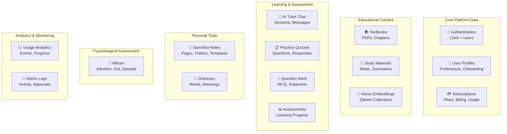
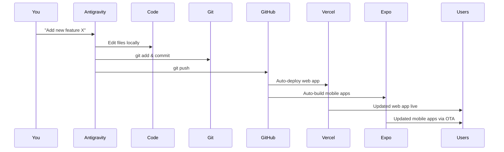
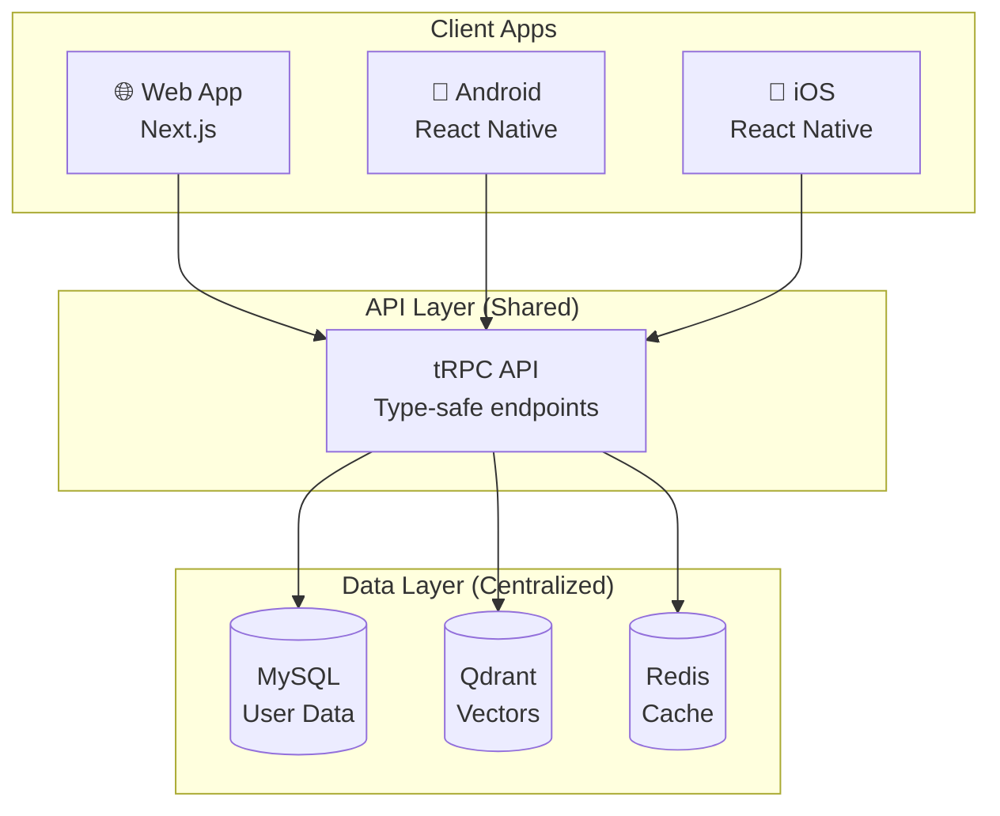

# DigiClassroom Pro - Complete Data, Architecture & DevOps Analysis

## 📊 Complete Data Inventory

Based on my analysis of 26 SQL schema files and the entire codebase, here are **all data types** in your application:

### Data Domain Overview



---

## 📁 Complete Database Table Inventory

### 1. 🔐 **Authentication & Users** (8 tables)
| Table | Purpose | Data Size/User |
|-------|---------|----------------|
| `users` | Core user records | 1 row |
| `user_profiles` | Board, class, stream preferences | 1 row |
| `tenants` | Multi-tenant organizations | Shared |
| `classes` | Class/grade organization | Shared |
| `user_quiz_preferences` | Quiz settings per user | 1 row |
| `user_achievements` | Badges and milestones | ~50 rows |
| `google_drive_config` | OAuth tokens | 1 row |
| `admin_activity_log` | Admin actions | Shared |

---

### 2. 💳 **Subscriptions & Billing** (6 tables)
| Table | Purpose | Data Size/User |
|-------|---------|----------------|
| `subscription_plans` | Plan definitions (Free, Basic, Pro) | Shared |
| `user_subscriptions` | Active subscriptions | 1-5 rows |
| `free_trials` | Trial tracking | 1 row |
| `ai_tutor_usage` | Daily question quota | 365 rows/year |
| `subscription_history` | Billing audit trail | 10-50 rows |
| `quota_alerts` | Limit notifications | 5-20 rows |

---

### 3. 📚 **Educational Content** (10 tables)
| Table | Purpose | Data Size |
|-------|---------|-----------|
| `content` | Lessons, exercises, resources | Shared |
| `materials` | Study materials (PDFs, notes) | Shared |
| `google_drive_folders` | Drive folder structure | Shared |
| `material_upload_sessions` | Batch upload tracking | Admin only |
| `material_upload_session_files` | Individual file tracking | Admin only |
| `material_approval_log` | Content moderation | Admin only |
| `vector_embeddings` | MySQL→Qdrant mapping | Shared |
| `pipeline_metrics` | PDF processing stats | Per upload |
| `practest_curriculum_structure` | NCERT chapter hierarchy | Shared |

---

### 4. 💬 **AI Tutor Chat** (6 tables)
| Table | Purpose | Data Size/User |
|-------|---------|----------------|
| `chat_sessions` | Conversation containers | ~100 sessions |
| `chat_messages` | Individual messages | ~500 messages |
| `menu_chatbot_sessions` | Menu-specific chats | ~50 sessions |
| `menu_chatbot_messages` | Menu chat messages | ~200 messages |
| `menu_chatbot_saved_queries` | Saved questions | ~20 queries |
| `menu_chatbot_personas` | AI persona configs | Shared |

---

### 5. 📋 **Practice Quizzes** (8 tables)
| Table | Purpose | Data Size/User |
|-------|---------|----------------|
| `quiz_categories` | Quiz types (CBSE, JEE, etc.) | Shared |
| `quiz_sessions` | Quiz attempts | ~200 sessions |
| `quiz_questions` | Question bank | Shared |
| `quiz_responses` | User answers | ~1000 responses |
| `quiz_analytics` | Daily quiz stats | 365 rows/year |
| `quiz_leaderboards` | Rankings | ~100 entries |
| `spaced_repetition_cards` | Flashcards (SM-2) | ~500 cards |

---

### 6. 🎯 **Practest Question Bank** (4 tables)
| Table | Purpose | Data Size |
|-------|---------|-----------|
| `practest_question_bank` | MCQ/Subjective questions | Shared (10K+) |
| `practest_test_configurations` | Test templates | Shared |
| `practest_test_sessions` | Test attempts | ~100/user |
| `practest_question_analytics` | Question performance | Per question |

---

### 7. 📒 **Sanchika Notes** (6 tables)
| Table | Purpose | Data Size/User |
|-------|---------|----------------|
| `user_notes` | Note content (multi-page) | ~100 notes |
| `note_folders` | Folder organization | ~20 folders |
| `note_shares` | Sharing links | ~10 shares |
| `note_templates` | Template library | Shared |
| `note_activity_log` | Edit history | ~500 entries |

---

### 8. 🧩 **Mitram Psychological Assessments** (11 tables)
| Table | Purpose | Data Size/User |
|-------|---------|----------------|
| `mitram_results` | Overall assessment scores | ~20 results |
| `mitram_sessions` | Assessment attempts | ~30 sessions |
| `mitram_attention_results` | TEA-Ch² attention data | ~10 results |
| `mitram_grit_results` | Grit scale scores | ~5 results |
| `mitram_decision_results` | ADMQ decision styles | ~5 results |
| `mitram_habit_results` | Habit assessments | ~10 results |
| `mitram_aptitude_results` | CogAT aptitude scores | ~5 results |
| `mitram_progress` | Progress tracking | 5 rows (per module) |
| `mitram_notifications` | Parent/teacher alerts | ~50 entries |
| `mitram_communications` | Parent-student comms | ~20 entries |
| `mitram_questions` | Psychology test bank | Shared |

---

### 9. 👁️ **Attention Assessments** (5 tables)
| Table | Purpose | Data Size/User |
|-------|---------|----------------|
| `attention_assessments` | TEA-Ch² main results | ~10 assessments |
| `attention_grade_norms` | Normative data | Shared |
| `attention_subtest_results` | Individual subtest data | ~40 results |
| `attention_responses` | Response-level data | ~500 responses |
| `attention_recommendations` | Personalized advice | ~20 recommendations |

---

### 10. 📖 **Dictionary** (3 tables)
| Table | Purpose | Data Size |
|-------|---------|-----------|
| `dictionary_words` | English-Hindi words | Shared (50K+) |
| `dictionary_word_forms` | Word variations | Shared |
| `dictionary_usage_examples` | Contextual examples | Shared |

---

### 11. 📈 **Analytics & Notifications** (5 tables)
| Table | Purpose | Data Size/User |
|-------|---------|----------------|
| `analytics_events` | User interaction logs | ~5000 events |
| `learning_progress` | Content completion | ~200 entries |
| `user_material_access` | Download tracking | ~100 entries |
| `notifications` | User notifications | ~50 entries |

---

## 🧠 Vector Database (Qdrant)

| Collection | Purpose | Dimensions | Estimated Vectors |
|------------|---------|------------|-------------------|
| `ncert-books-enhanced` | Textbook embeddings | 3072 | 100K+ |
| `digiclassroom` | General content | 3072 | 50K+ |

**Storage Estimate**: ~5-10 GB for 150K vectors

---

## 💡 Innovative Minimum-Cost Architecture

### Strategy: "Offline Processing + Lightweight Runtime"

```
┌────────────────────────────────────────────────────────────────────────┐
│  YOUR LOCAL MACHINE (One-Time Processing)                              │
│  ────────────────────────────────────────────────────────────────────  │
│  ✅ GPU-intensive PDF processing (PaddleOCR, DocLayout-YOLO)           │
│  ✅ Generate OpenAI embeddings → Create Qdrant snapshots              │
│  ✅ Pre-process question banks                                         │
│  ✅ Optimize images/assets                                             │
└────────────────────────────────────────────────────────────────────────┘
                               │
                               ▼ (Upload once via GitHub LFS or S3)
┌────────────────────────────────────────────────────────────────────────┐
│  ULTRA-CHEAP CLOUD (Runtime Only)                                       │
│  ────────────────────────────────────────────────────────────────────  │
│                                                                        │
│  ┌─────────────────┐    ┌─────────────────┐    ┌─────────────────┐     │
│  │  Vercel Edge    │────│  PlanetScale    │────│  Qdrant Cloud   │     │
│  │  (Next.js App)  │    │  (MySQL)        │    │  (Vectors)      │     │
│  │  FREE->$20/mo   │    │  FREE->$29/mo   │    │  FREE->$35/mo   │     │
│  └─────────────────┘    └─────────────────┘    └─────────────────┘     │
│           │                                                            │
│           ▼                                                            │
│  ┌─────────────────┐    ┌─────────────────┐                            │
│  │  Upstash Redis  │    │  Cloudflare R2  │                            │
│  │  (Caching)      │    │  (File Storage) │                            │
│  │  FREE->$10/mo   │    │  FREE->$5/mo    │                            │
│  └─────────────────┘    └─────────────────┘                            │
│                                                                        │
└────────────────────────────────────────────────────────────────────────┘

TOTAL: ₹0 - ₹8,000/month (10K-30K users)
```

### Key Optimizations:

1. **No GPU Needed at Runtime** - All PDF processing done locally
2. **Serverless Everything** - Pay only for actual usage
3. **Edge Caching** - 80% of requests cached near users
4. **Pre-computed Answers** - Common questions cached
5. **Lazy Loading** - Load only what users request

---

## 🔗 GitHub + Antigravity Workflow

### Repository Structure:
```
DigiClassroom Pro (Private GitHub Repo)
├── .github/
│   └── workflows/
│       ├── deploy-web.yml      # Auto-deploy to Vercel
│       ├── deploy-mobile.yml   # Build Android/iOS
│       └── test.yml            # Run tests on PR
├── apps/
│   ├── web/                    # Next.js app (current code)
│   ├── mobile/                 # React Native/Expo app
│   └── shared/                 # Shared components/logic
├── packages/
│   ├── api/                    # tRPC routers
│   ├── db/                     # Database schemas
│   └── ui/                     # Shared UI components
└── data/
    ├── qdrant-snapshots/       # Pre-built vector DB
    └── question-banks/         # Pre-processed questions
```

### Antigravity Linked Editing:

```bash
# Clone your private repo locally
git clone https://github.com/YOUR_USERNAME/DigiClassroom-Pro.git

# Open in VS Code with Antigravity
# Antigravity can now:
# - Read/edit all files
# - Run git commands
# - Push changes to GitHub
# - Trigger deployments
```

**Workflow:**


---

## 📱 Cross-Platform Single-Codebase Strategy

### Recommended Approach: **Monorepo with React Native Web**

```
┌─────────────────────────────────────────────────────────────────┐
│                    SHARED CODEBASE (80%)                        │
│  ─────────────────────────────────────────────────────────────  │
│  • tRPC API (type-safe, works everywhere)                       │
│  • Database queries (same MySQL/Qdrant)                         │
│  • Business logic (authentication, subscriptions)               │
│  • State management (Zustand)                                   │
│  • UI components (React Native Web compatible)                  │
└─────────────────────────────────────────────────────────────────┘
         │                    │                    │
         ▼                    ▼                    ▼
┌──────────────┐     ┌──────────────┐     ┌──────────────┐
│  WEB (20%)   │     │ ANDROID (20%)│     │  iOS (20%)   │
│  Next.js     │     │  Expo/RN     │     │  Expo/RN     │
│  Vercel      │     │  Play Store  │     │  App Store   │
└──────────────┘     └──────────────┘     └──────────────┘
```

### Implementation Options:

#### Option A: **Expo + React Native Web (Recommended)**
- **Pros**: Single codebase, OTA updates, 90% code sharing
- **Cons**: Some Next.js features need adaptation
- **Cost**: Free (Expo EAS: $99/year for unlimited builds)

#### Option B: **Capacitor (Ionic) Wrapper**
- **Pros**: Keep existing Next.js code, wrap in native shell
- **Cons**: Not truly native, some performance limitations
- **Cost**: Free

#### Option C: **Separate Native Apps with Shared API**
- **Pros**: Best performance, full native features
- **Cons**: 3x development effort
- **Cost**: Higher maintenance

### Synchronized Data Architecture:



**Key Features:**
- **Real-time Sync**: All platforms share same database
- **Offline Support**: Local SQLite + sync when online
- **Push Notifications**: Firebase FCM (Android) + APNs (iOS)
- **Type Safety**: tRPC ensures API consistency

---

## 💰 Final Cost Breakdown (10K-100K Users)

### Tier 1: Bootstrap (0-10K users) - ₹0-8,000/month
| Service | Plan | Cost |
|---------|------|------|
| Hosting | Vercel Free | ₹0 |
| Database | PlanetScale Free | ₹0 |
| Vector DB | Qdrant Cloud Free | ₹0 |
| Cache | Upstash Free | ₹0 |
| Auth | Clerk Free (10K MAU) | ₹0 |
| AI API | OpenAI (pay per use) | ₹5,000-8,000 |
| **Total** | | **₹5,000-8,000/mo** |

### Tier 2: Growth (10K-50K users) - ₹15,000-30,000/month
| Service | Plan | Cost |
|---------|------|------|
| Hosting | Vercel Pro | ₹1,700 |
| Database | PlanetScale Scaler | ₹2,500 |
| Vector DB | Qdrant Cloud Starter | ₹4,000 |
| Cache | Upstash Pro | ₹850 |
| Auth | Clerk Pro | ₹2,000 |
| AI API | OpenAI | ₹10,000-20,000 |
| **Total** | | **₹20,000-30,000/mo** |

### Tier 3: Scale (50K-100K users) - ₹50,000-80,000/month
| Service | Plan | Cost |
|---------|------|------|
| Hosting | AWS/Vercel Enterprise | ₹10,000 |
| Database | PlanetScale Team | ₹8,000 |
| Vector DB | Qdrant Cloud Pro | ₹15,000 |
| Cache | Upstash Enterprise | ₹3,000 |
| Auth | Clerk Enterprise | ₹4,000 |
| AI API | OpenAI | ₹20,000-40,000 |
| **Total** | | **₹60,000-80,000/mo** |

---

## ✅ Next Steps

1. **Create private GitHub repo** and push your code
2. **Set up Vercel** connected to GitHub (auto-deploy on push)
3. **Create PlanetScale database** and migrate MySQL data
4. **Set up Qdrant Cloud** and upload your local snapshots
5. **Configure Expo** for React Native mobile apps
6. **Use Antigravity** to edit code → auto-deploy everywhere

Would you like me to create a detailed step-by-step setup guide for any of these?
