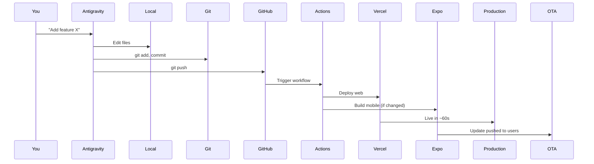

# Step 7: CI/CD Workflow Configuration

## Overview
Set up automated deployment pipelines using GitHub Actions for web (Vercel) and mobile (Expo EAS) builds.

---

## 7.1 Web Deployment Workflow

```yaml
# .github/workflows/deploy-web.yml
name: Deploy Web to Vercel

on:
  push:
    branches: [main]
    paths:
      - 'apps/web/**'
      - 'packages/**'
      - 'package.json'
  pull_request:
    branches: [main]

env:
  VERCEL_ORG_ID: ${{ secrets.VERCEL_ORG_ID }}
  VERCEL_PROJECT_ID: ${{ secrets.VERCEL_PROJECT_ID }}

jobs:
  deploy:
    runs-on: ubuntu-latest
    steps:
      - name: Checkout
        uses: actions/checkout@v4

      - name: Setup Node.js
        uses: actions/setup-node@v4
        with:
          node-version: '20'
          cache: 'npm'

      - name: Install Dependencies
        run: npm ci

      - name: Run Tests
        run: npm test
        continue-on-error: true

      - name: Install Vercel CLI
        run: npm i -g vercel@latest

      - name: Pull Vercel Environment
        run: vercel pull --yes --environment=production --token=${{ secrets.VERCEL_TOKEN }}

      - name: Build Project
        run: vercel build --prod --token=${{ secrets.VERCEL_TOKEN }}

      - name: Deploy to Vercel
        run: vercel deploy --prebuilt --prod --token=${{ secrets.VERCEL_TOKEN }}

      - name: Notify Success
        if: success()
        run: echo "✅ Deployed to production!"
```

---

## 7.2 Mobile Build Workflow

```yaml
# .github/workflows/build-mobile.yml
name: Build Mobile Apps

on:
  push:
    branches: [main]
    paths:
      - 'apps/mobile/**'
      - 'packages/**'
  workflow_dispatch:
    inputs:
      platform:
        description: 'Platform to build'
        required: true
        default: 'all'
        type: choice
        options:
          - all
          - android
          - ios
      profile:
        description: 'Build profile'
        required: true
        default: 'preview'
        type: choice
        options:
          - development
          - preview
          - production

jobs:
  build:
    runs-on: ubuntu-latest
    steps:
      - name: Checkout
        uses: actions/checkout@v4

      - name: Setup Node.js
        uses: actions/setup-node@v4
        with:
          node-version: '20'
          cache: 'npm'

      - name: Setup Expo
        uses: expo/expo-github-action@v8
        with:
          eas-version: latest
          token: ${{ secrets.EXPO_TOKEN }}

      - name: Install Dependencies
        run: |
          cd apps/mobile
          npm ci

      - name: Build Android
        if: ${{ github.event.inputs.platform == 'android' || github.event.inputs.platform == 'all' || github.event_name == 'push' }}
        run: |
          cd apps/mobile
          eas build --platform android --profile ${{ github.event.inputs.profile || 'preview' }} --non-interactive

      - name: Build iOS
        if: ${{ github.event.inputs.platform == 'ios' || github.event.inputs.platform == 'all' }}
        run: |
          cd apps/mobile
          eas build --platform ios --profile ${{ github.event.inputs.profile || 'preview' }} --non-interactive
```

---

## 7.3 Testing Pipeline

```yaml
# .github/workflows/test.yml
name: Run Tests

on:
  pull_request:
    branches: [main, development]
  push:
    branches: [development]

jobs:
  test:
    runs-on: ubuntu-latest
    steps:
      - name: Checkout
        uses: actions/checkout@v4

      - name: Setup Node.js
        uses: actions/setup-node@v4
        with:
          node-version: '20'
          cache: 'npm'

      - name: Install Dependencies
        run: npm ci

      - name: Type Check
        run: npm run type-check || true

      - name: Lint
        run: npm run lint

      - name: Run Unit Tests
        run: npm test -- --coverage

      - name: Upload Coverage
        uses: codecov/codecov-action@v3
        with:
          token: ${{ secrets.CODECOV_TOKEN }}
```

---

## 7.4 OTA Update Workflow

```yaml
# .github/workflows/ota-update.yml
name: Publish OTA Update

on:
  push:
    branches: [main]
    paths:
      - 'apps/mobile/app/**'
      - 'apps/mobile/components/**'
  workflow_dispatch:

jobs:
  update:
    runs-on: ubuntu-latest
    steps:
      - name: Checkout
        uses: actions/checkout@v4

      - name: Setup Node.js
        uses: actions/setup-node@v4
        with:
          node-version: '20'
          cache: 'npm'

      - name: Setup Expo
        uses: expo/expo-github-action@v8
        with:
          eas-version: latest
          token: ${{ secrets.EXPO_TOKEN }}

      - name: Install Dependencies
        run: |
          cd apps/mobile
          npm ci

      - name: Publish Update
        run: |
          cd apps/mobile
          eas update --branch production --message "${{ github.event.head_commit.message }}"
```

---

## 7.5 Required Secrets

Add these in `Settings > Secrets and variables > Actions`:

| Secret | Source |
|--------|--------|
| `VERCEL_TOKEN` | [Vercel Account Settings](https://vercel.com/account/tokens) |
| `VERCEL_ORG_ID` | Vercel project settings |
| `VERCEL_PROJECT_ID` | Vercel project settings |
| `EXPO_TOKEN` | [Expo Access Tokens](https://expo.dev/settings/access-tokens) |
| `CODECOV_TOKEN` | [Codecov](https://codecov.io) (optional) |

---

## 7.6 Antigravity Integration Workflow

When you use me (Antigravity) to make changes:



**Commands I run:**
```bash
git add .
git commit -m "feat: your feature description"
git push origin main
```

---

## 7.7 Branch Strategy

| Branch | Trigger | Deployment |
|--------|---------|------------|
| `main` | Push | Production |
| `development` | Push | Preview/Staging |
| `feature/*` | PR | Preview URL |

---

## ✅ Verification Checklist

- [ ] Web deployment workflow created
- [ ] Mobile build workflow created
- [ ] Testing pipeline configured
- [ ] OTA update workflow set up
- [ ] All secrets added to GitHub
- [ ] Test push triggers deployment

---

## 🔄 Complete Automation Flow

```
Code Change
    │
    ▼
Git Push to GitHub
    │
    ├──► Test Workflow (PR)
    │       ├── Lint
    │       ├── Type check
    │       └── Unit tests
    │
    ▼
Main Branch (merge)
    │
    ├──► Deploy Web
    │       └── Vercel (60s)
    │
    ├──► Build Mobile (if changed)
    │       ├── Android APK/AAB
    │       └── iOS IPA
    │
    └──► OTA Update (if mobile changed)
            └── Instant update to users
```

---

## Next Step
Your deployment pipeline is now complete! 🎉

→ Return to [Complete Architecture Analysis](../complete_architecture_analysis.md)
