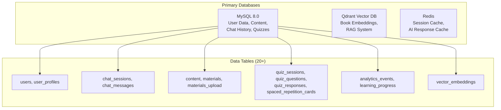

# DigiClassroom Pro - Hosting Analysis Report

## 📊 Current Hosting Plan Analysis

Based on your cPanel hosting screenshots, here are your current resources:

| Resource | Limit | Current Usage | Assessment |
|----------|-------|---------------|------------|
| **Disk Space** | 200 GB | 4.01 GB (2.01%) | ✅ Adequate |
| **Bandwidth** | 1 TB/month | 949 MB (0.09%) | ⚠️ May be insufficient for 100K users |
| **Database Disk** | 196 GB | 73.19 MB (0.04%) | ✅ Adequate |
| **RAM** | 4 GB | 0 bytes | ❌ **Critical: Insufficient** |
| **Entry Processes** | 50 | 0 | ❌ **Critical: Insufficient** |
| **Max Processes** | 300 | 0 | ⚠️ May be limiting |
| **IOPS** | 2,048 | 0 | ⚠️ May bottleneck |
| **I/O Speed** | 200 MB/s | 0 | ⚠️ Limiting for AI workloads |
| **Addon Domains** | 49 | 12 used | ✅ Adequate |
| **Subdomains** | Unlimited | 14 used | ✅ Adequate |

---

## ❌ Critical Issues: Why Your Current Hosting CANNOT Support DigiClassroom Pro

> [!CAUTION]
> **Your current cPanel shared hosting is fundamentally incompatible with DigiClassroom Pro's architecture.**

### 1. **No Node.js Runtime Support**
Your app is built with **Next.js 15.3.4** which requires Node.js 18+. Traditional cPanel shared hosting does NOT support:
- Persistent Node.js processes
- Next.js server-side rendering (SSR)
- tRPC API endpoints
- WebSocket connections for real-time features

### 2. **No Docker/Container Support**
Your app requires **Docker containers** for:
- MySQL 8.0 database
- Qdrant vector database (for AI/RAG)
- Redis cache server
- Next.js application container

**cPanel shared hosting cannot run Docker.**

### 3. **No GPU Access for AI Features**
Your PDF processing engine requires **NVIDIA GPU with CUDA 11.8** for:
- PaddleOCR document processing
- PyTorch-based models
- DocLayout-YOLO for layout detection
- UniMERNet for formula recognition

**Shared hosting has no GPU access.**

### 4. **No Vector Database Support (Qdrant)**
Your RAG system requires **Qdrant vector database** for:
- Storing 3072-dimensional embeddings
- Semantic search across textbooks
- AI Tutor context retrieval

**Qdrant cannot run on cPanel hosting.**

### 5. **Insufficient Concurrent Connections**
| Metric | Your Limit | Required for 10K-100K Users |
|--------|-----------|----------------------------|
| Entry Processes | 50 | 500-5000 |
| Max Processes | 300 | 3000-30000 |
| RAM | 4 GB | 32-128 GB |

---

## 📦 Your Application's Database Requirements

Based on codebase analysis, you have **5+ database types**:



### Database Volume Estimates for 100K Users

| Data Type | Records/User | Total Records | Storage |
|-----------|--------------|---------------|---------|
| User Profiles | 1 | 100K | 500 MB |
| Chat Messages | ~500 | 50M | 25 GB |
| Learning Progress | ~200 | 20M | 5 GB |
| Quiz Responses | ~1000 | 100M | 15 GB |
| Analytics Events | ~5000 | 500M | 50 GB |
| **Vector Embeddings** | ~100 | 10M | **100+ GB** |
| Study Materials | Shared | 50K files | 200 GB |

---

## 🎯 Recommended Hosting Solutions

### Option 1: Vercel + Managed Services (⭐ **Recommended for Indian Market**)

> [!IMPORTANT]
> **Best for: Speed, Security, Minimum Investment Starting Point**

| Component | Service | Monthly Cost (₹) | Notes |
|-----------|---------|------------------|-------|
| **Frontend/API** | Vercel Pro | ₹1,700 (~$20) | Mumbai edge, auto-scaling |
| **Database** | PlanetScale (MySQL) | ₹2,500 (~$29) | Serverless MySQL |
| **Vector DB** | Qdrant Cloud | Free-₹4,000 | 1GB free tier |
| **Cache** | Upstash Redis | Free-₹850 | Serverless Redis |
| **Auth** | Clerk | Free-₹2,000 | 10K MAU free |
| **AI API** | OpenAI | ₹8,000-25,000 | Pay per use |
| **PDF Processing** | Separate GPU Server | ₹5,000-15,000 | Vast.ai/RunPod |

**Total: ₹20,000 - ₹50,000/month** for 10K-50K users

#### Architecture:
```
Users (India) → Vercel Edge (Mumbai) → PlanetScale → Qdrant Cloud
                      ↓
              Upstash Redis (Cache)
                      ↓
              OpenAI API (AI Responses)
```

---

### Option 2: AWS India (Mumbai Region) - **Best for Scaling**

| Component | Service | Monthly Cost (₹) |
|-----------|---------|------------------|
| **Compute** | ECS Fargate | ₹8,000-25,000 |
| **Database** | RDS MySQL | ₹5,000-15,000 |
| **Vector DB** | Self-hosted Qdrant on EC2 | ₹4,000-10,000 |
| **Cache** | ElastiCache Redis | ₹3,000-8,000 |
| **CDN** | CloudFront | ₹2,000-5,000 |
| **GPU** | EC2 G4dn (on-demand) | ₹15,000-40,000 |
| **Storage** | S3 | ₹1,000-3,000 |

**Total: ₹40,000 - ₹1,00,000/month** for 50K-100K users

---

### Option 3: DigitalOcean/Vultr (Budget Option)

| Component | Service | Monthly Cost (₹) |
|-----------|---------|------------------|
| **App Server** | 8GB Droplet | ₹4,000 |
| **Database** | Managed MySQL | ₹3,000 |
| **Vector DB** | Self-hosted Qdrant | ₹2,000 |
| **Cache** | Managed Redis | ₹1,500 |
| **GPU** | External (RunPod) | ₹5,000 |

**Total: ₹15,000 - ₹30,000/month** for 10K-30K users

> [!WARNING]
> **Limitation**: No native GPU hosting, must use external GPU services for PDF processing.

---

### Option 4: Indian Cloud Providers (Lowest Latency)

| Provider | Offerings | Monthly Cost (₹) |
|----------|-----------|------------------|
| **E2E Networks** | GPU Cloud, VPS | ₹20,000-50,000 |
| **Yotta** | Data center services | Enterprise pricing |
| **CtrlS** | Managed cloud | ₹30,000+ |

---

## 📊 Comparison Matrix

| Factor | Vercel Stack | AWS India | DigitalOcean | Indian Cloud |
|--------|--------------|-----------|--------------|--------------|
| **Speed in India** | ⭐⭐⭐⭐ | ⭐⭐⭐⭐⭐ | ⭐⭐⭐ | ⭐⭐⭐⭐⭐ |
| **Setup Complexity** | ⭐⭐ (Easy) | ⭐⭐⭐⭐ (Complex) | ⭐⭐⭐ | ⭐⭐⭐ |
| **Cost (10K users)** | ₹20K | ₹40K | ₹15K | ₹25K |
| **Cost (100K users)** | ₹80K | ₹1L | ₹60K | ₹80K |
| **Scaling** | ⭐⭐⭐⭐⭐ | ⭐⭐⭐⭐⭐ | ⭐⭐⭐ | ⭐⭐⭐ |
| **GPU Support** | External | Native | External | Native |
| **Security** | ⭐⭐⭐⭐⭐ | ⭐⭐⭐⭐⭐ | ⭐⭐⭐⭐ | ⭐⭐⭐⭐ |
| **India Compliance** | ⭐⭐⭐ | ⭐⭐⭐⭐ | ⭐⭐⭐ | ⭐⭐⭐⭐⭐ |

---

## 🚀 My Recommendation: Hybrid Approach

> [!TIP]
> **For minimum investment + maximum results, use this architecture:**

### Phase 1: Launch (10K Users, ₹15,000-25,000/month)
```
Vercel (Free tier) + PlanetScale (Free tier) + Qdrant Cloud (Free) 
+ Upstash Redis (Free) + OpenAI API (Pay per use)
```

### Phase 2: Growth (10K-50K Users, ₹30,000-50,000/month)
```
Vercel Pro + PlanetScale Scaler + Qdrant Cloud (Paid) 
+ Upstash Pro + RunPod GPU (for PDF processing)
```

### Phase 3: Scale (50K-100K Users, ₹75,000-1,50,000/month)
```
AWS India (ECS + RDS + ElastiCache) 
+ Managed Qdrant + EC2 GPU instances
```

---

## ⚠️ What to Do with Your Current Hosting

Your current cPanel hosting can still be used for:
1. **Landing page** - Static marketing website
2. **Email hosting** - 8 email accounts already set up
3. **File storage** - Store downloadable PDFs/study materials
4. **Blog** - Simple WordPress blog for SEO

**But NOT for the main DigiClassroom Pro application.**

---

## 🔒 Security Considerations

1. **Data Localization**: For Indian users, consider:
   - AWS Mumbai region for GDPR compliance
   - Indian cloud providers for data sovereignty

2. **SSL/TLS**: All recommended solutions include free SSL

3. **DDoS Protection**: 
   - Vercel/AWS: Built-in
   - DigitalOcean: Add Cloudflare ($0-20/month)

4. **Authentication**: Clerk handles this securely

---

## 📱 Next Steps

1. **Immediate**: Keep your current hosting for landing page/marketing
2. **Week 1**: Sign up for Vercel + PlanetScale + Qdrant Cloud (all free tiers)
3. **Week 2**: Deploy DigiClassroom Pro to Vercel
4. **Week 3**: Set up GPU processing pipeline (RunPod/Vast.ai)
5. **Month 2+**: Monitor usage and scale as needed

---

## 💰 Investment Summary

| User Scale | Monthly Cost (₹) | Yearly Cost (₹) |
|------------|------------------|-----------------|
| 0-10K | 15,000-25,000 | 1.8L-3L |
| 10K-50K | 30,000-50,000 | 3.6L-6L |
| 50K-100K | 75,000-1,50,000 | 9L-18L |

> [!NOTE]
> These costs include all infrastructure, AI API calls, and processing. Your current hosting (~₹3,000-5,000/month) is insufficient but can be retained for auxiliary purposes.
